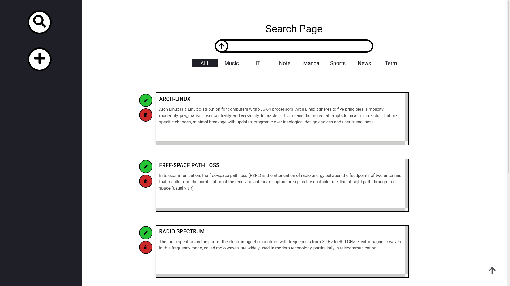
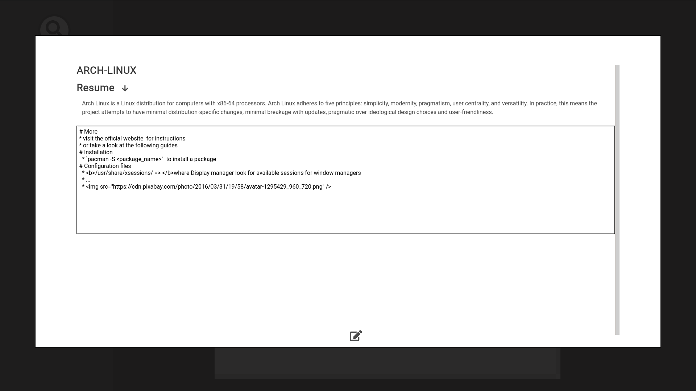
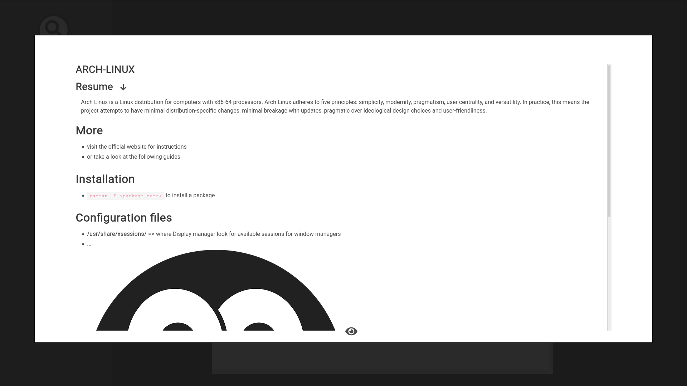
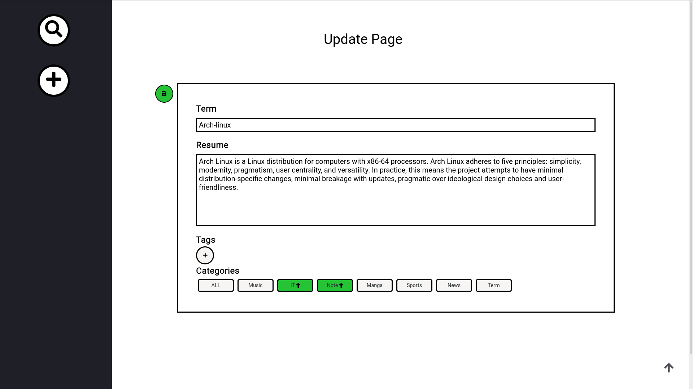

# Note
## What you get !!
### Home page

    

Lookup previously created notes.  
Features: 
 - Search-bar 
 - Categories
 - Tagging

### Edit mode 

    

Create rich notes using `markdown`

### View mode 

    

Preview your beautiful notes with a simple click 🖱️

### Update page

    

Update previously created notes content.Then `tag` or `categorize` them.

## Demo
Vist this [link](https://notes-app-d3555.web.app)

### Local setup
### 1.Install dependencies
Run `npm install && npm install -g @angular/cli`

### 2.Backend

Follow [here](https://github.com/HazemBZ/notes-app-flask-backend/tree/master)

### 3.Development server

Run `ng serve` for a dev server. Navigate to `http://localhost:4200/`. The app will automatically reload if you change any of the source files

Run `firebase emulators:start` to fireup a local firebase web server offline 
